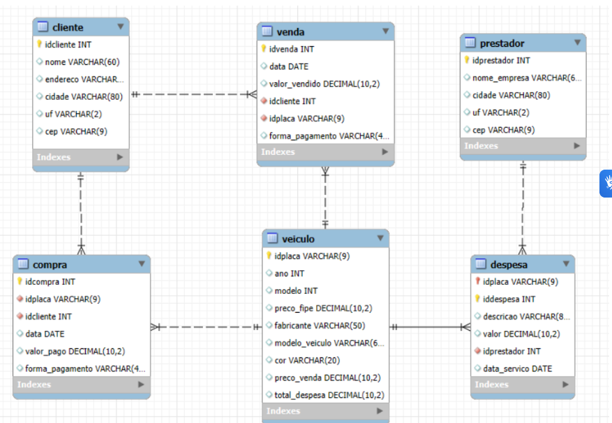

# flask-gestao_veiculo
# Sistema de Gerenciamento de Veículos

Uma aplicação web completa, desenvolvida em Python com o framework Flask, para gerenciar as operações de uma revendedora de veículos usados. O sistema permite controlar todo o ciclo de vida de um veículo, desde a compra até a venda, incluindo o registro de despesas e o cálculo de lucratividade.

## 📜 Sobre o Projeto

Este projeto foi desenvolvido como um exercício prático para aplicar conceitos de desenvolvimento web com Flask, utilizando SQLAlchemy como ORM para interagir com um banco de dados MySQL e Jinja2 para a renderização de templates HTML. A estrutura e a lógica de negócio são baseadas em um diagrama de entidade-relacionamento (ERD) que modela as operações de uma concessionária.

## ✨ Funcionalidades

- **Cadastro de Veículos:** Registro de novos veículos adquiridos pela revenda.
- **Listagem e Visualização:** Tela principal com a lista de todos os veículos e seu status (Disponível/Vendido).
- **Página de Detalhes:** Visualização completa de um veículo, incluindo dados da compra, lista de despesas e informações da venda.
- **Registro de Despesas:** Formulário para adicionar custos de manutenção e preparação associados a cada veículo.
- **Registro de Vendas:** Formulário para registrar a venda de um veículo a um cliente final.
- **Relatório de Lucratividade:** Página que calcula e exibe o lucro obtido em cada veículo vendido.

## 🛠️ Tecnologias Utilizadas

- **Backend:** Python
- **Framework:** Flask
- **ORM:** SQLAlchemy
- **Banco de Dados:** mysql
- **Frontend:** HTML5, CSS3
- **Template Engine:** Jinja2

## 🖼️ Diagrama do Banco de Dados

A aplicação segue a estrutura definida pelo seguinte Diagrama de Entidade-Relacionamento:

